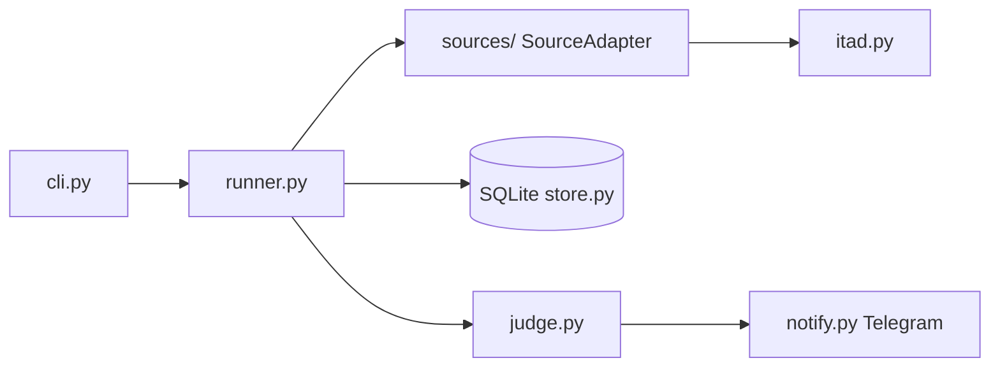

# DealScout 🎯

Personal price-watching agent. Watches game deals (and soon Shopee/Lazada),
stores price history, judges whether a "deal" is real, and pings you on
Telegram with the reasoning.

## Why

Price trackers record prices. DealScout is built to *reason* about them —
M2 adds LLM-driven page understanding for stores without APIs and
fake-discount detection from price history.

## Quick start

```bash
python -m venv .venv && .venv\Scripts\activate
pip install -e ".[dev]"
copy .env.example .env   # fill in ITAD + Telegram keys
dealscout add "Hades" --min-cut 30
dealscout run            # one monitoring pass
dealscout report 1       # price history
```

On Linux/macOS, replace the activation step with `source .venv/bin/activate`
and `cp .env.example .env`.

Required environment variables (see `.env.example`):

| Variable | Purpose |
| --- | --- |
| `ITAD_API_KEY` | API key from [isthereanydeal.com/apps](https://isthereanydeal.com/apps) |
| `TELEGRAM_BOT_TOKEN` | Bot token from [@BotFather](https://t.me/BotFather) |
| `TELEGRAM_CHAT_ID` | Chat/user ID that receives notifications |
| `DEALSCOUT_DB` | *(optional)* SQLite file path, defaults to `dealscout.db` |

### Commands

- `dealscout add TITLE [--max-price N] [--min-cut PCT] [--country CC]` — look up `TITLE` on IsThereAnyDeal and start watching it. Trigger when the best price drops to `--max-price` or the discount reaches `--min-cut`%. `--country` defaults to `MY`.
- `dealscout list` — show all active watches and their trigger conditions.
- `dealscout run` — run one monitoring pass over every watch: fetch current prices, judge each against its rule, and notify on Telegram for new deals (deduplicated so you're not pinged twice for the same deal).
- `dealscout report WATCH_ID [--limit N]` — print recent price history for a watch (defaults to the last 10 entries).

## Architecture



Every layer exchanges Pydantic models and is tested offline with
httpx.MockTransport. No agent framework — the loop is ~40 lines you can read.

- `cli.py` — Typer CLI (`add` / `list` / `run` / `report`); thin wiring only.
- `runner.py` — one monitoring pass per watch: fetch price, judge, notify, record.
- `sources/` — `SourceAdapter` protocol (`base.py`) with an ITAD implementation (`itad.py`); new stores plug in by implementing the same protocol.
- `store.py` — SQLite persistence for watches, price history, and notification dedup.
- `judge.py` — rule evaluation: does the current price satisfy `max_price` / `min_cut`?
- `notify.py` — formats a `Deal` and sends it via the Telegram Bot API.

## Scheduled runs

Windows Task Scheduler:
```
schtasks /create /tn DealScout /tr "C:\path\to\.venv\Scripts\dealscout.exe run" /sc daily /st 09:00
```

Linux/macOS cron:
```
0 9 * * * cd /path/to/dealscout && .venv/bin/dealscout run
```

Both invoke `dealscout run`, which is idempotent and safe to run unattended:
each pass only notifies for deals that haven't already been sent.

## Roadmap

- [x] M1: ITAD source -> SQLite -> rule trigger -> Telegram
- [ ] M2: natural-language watch rules; Shopee/Lazada via Playwright + LLM extraction; fake-discount judge
- [ ] M3: eval harness in CI, cost tracking, spin off `llm-page-extract`
